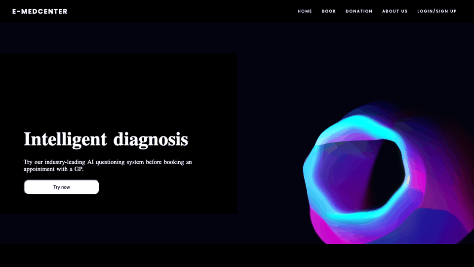
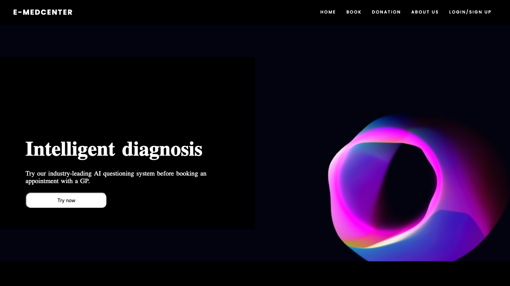
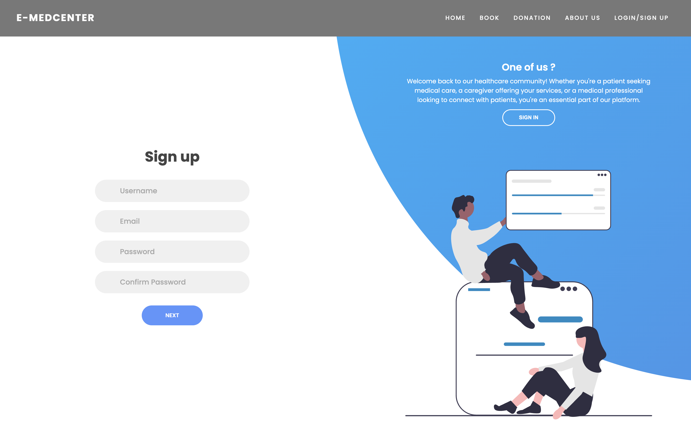
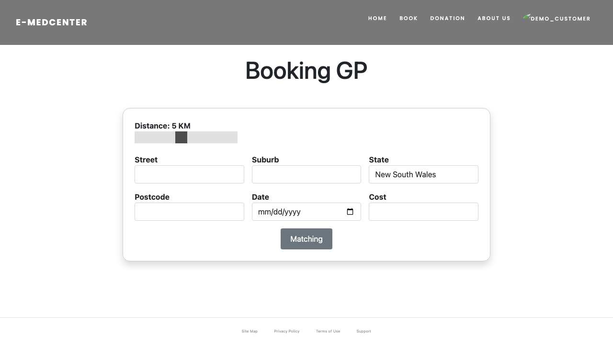
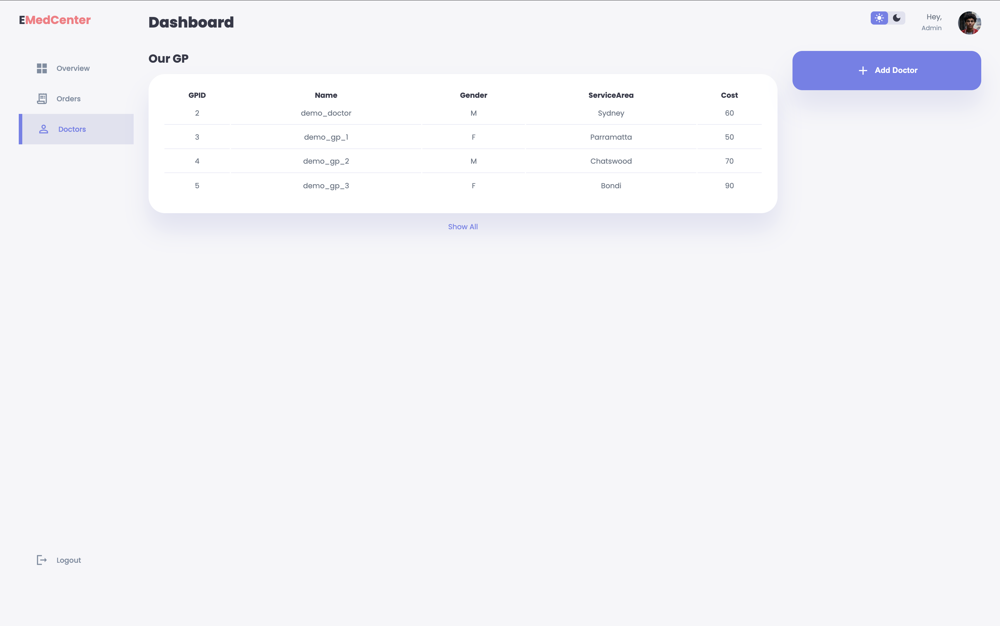

# E‑MediCenter

[](.github/workflows/ci.yml)<br>
<br>
<br>
<br>
<br>


E‑MediCenter is a demo Django web app for booking General Practitioners (GPs) and caregivers, with role‑based dashboards and optional map‑assisted address input.









Social preview image for GitHub: `docs/assets/social-preview.png` (upload via repo Settings → Social preview).

## Features

- Role-based dashboards (admin / doctor / caregiver / customer)
- Booking & matching (GPs and caregivers)
- Orders pages (AJAX fetch)
- Optional integrations:
  - Google Maps Places autocomplete (+ distance matching when configured)
  - OpenAI `/ask/` demo chatbot endpoint

## Tech stack

- Backend: Django 4.2 (Python)
- Frontend: Django Templates + static assets (no separate build step)
- Database: SQLite (default)
- Container: Docker + docker-compose

## Architecture

- Monolithic Django app with server-rendered HTML (`templates/`) and static assets (`EMediCenter/static/`)
- SQLite by default (migrations included); demo data via `python3 manage.py seed_demo`
- Dashboards use AJAX to call internal JSON endpoints under `/api/`
- Optional integrations:
  - Google Maps Places autocomplete (front-end) + distance matching (server) when `GOOGLE_MAPS_API_KEY` is set
  - OpenAI `/ask/` demo chatbot endpoint when `OPENAI_API_KEY` is set

## Key routes

- Pages:
  - `/` (Home)
  - `/Login` (Login / Sign up)
  - `/book_GP/` and `/book_caregiver/` (booking + matching)
  - `/admin_dashboard/`, `/admin_doctors/` (admin dashboards)
  - `/doctor_dashboard/`, `/caregiver_dashboard/`, `/user_dashboard/`
- JSON APIs (used by dashboards):
  - `/api/orders/caregivers/`, `/api/orders/caregivers/recent/`
  - `/api/orders/gps/`, `/api/orders/gps/recent/`
  - `/api/doctors/`, `/api/doctors/featured/`

## Quickstart

### Local (recommended for development)

```bash
python3 -m venv .venv
source .venv/bin/activate
python3 -m pip install -r requirements.txt

cp .env.example .env
# edit .env and set DJANGO_SECRET_KEY

python3 manage.py migrate
python3 manage.py seed_demo --clear
python3 manage.py runserver
```

Open `http://localhost:8000/`.

### Docker

```bash
cp .env.example .env
# edit .env and set DJANGO_SECRET_KEY

docker-compose up --build
```

## Demo data

Seeded demo accounts (default password: `demo12345`):

- `demo_admin` → `/admin_dashboard/`
- `demo_doctor` → `/doctor_dashboard/`
- `demo_caregiver` → `/caregiver_dashboard/`
- `demo_customer` → `/user_dashboard/`

## Configuration

Configuration is via environment variables (loaded from `.env` if present):

- `DJANGO_DEBUG` (`1`/`0`)
- `DJANGO_SECRET_KEY` (required when `DJANGO_DEBUG=0`)
- `DJANGO_ALLOWED_HOSTS` (comma-separated, e.g. `localhost,127.0.0.1`)
- `GOOGLE_MAPS_API_KEY` (optional; enables Places autocomplete + distance matching)
- `OPENAI_API_KEY` (optional; enables `/ask/`)

Generate a Django secret key with:

```bash
python3 -c "import secrets; print(secrets.token_urlsafe(50))"
```

## Project structure

- `EMediCenter/` Django app (settings, views, models, migrations)
- `templates/` server-rendered HTML templates
- `EMediCenter/static/` CSS/JS/images
- `tests/` Django tests

## Roadmap

- Add more screenshots/GIF to `docs/assets/` (GitHub-ready showcase)
- Extend CI with linting/format checks (optional)
- Improve demo data and reduce external API coupling (more mocks / fallbacks)

## Development

Run tests:

```bash
python3 manage.py test
```

## CI

GitHub Actions workflow: `.github/workflows/ci.yml` runs Django tests on PRs and pushes.

Contributing guide: `CONTRIBUTING.md`  
Security policy: `SECURITY.md`

## Privacy & disclaimer

This is a demo project. Do **not** use real medical/personal data.  
See `PRIVACY.md`.

## License

MIT. See `LICENSE`.
